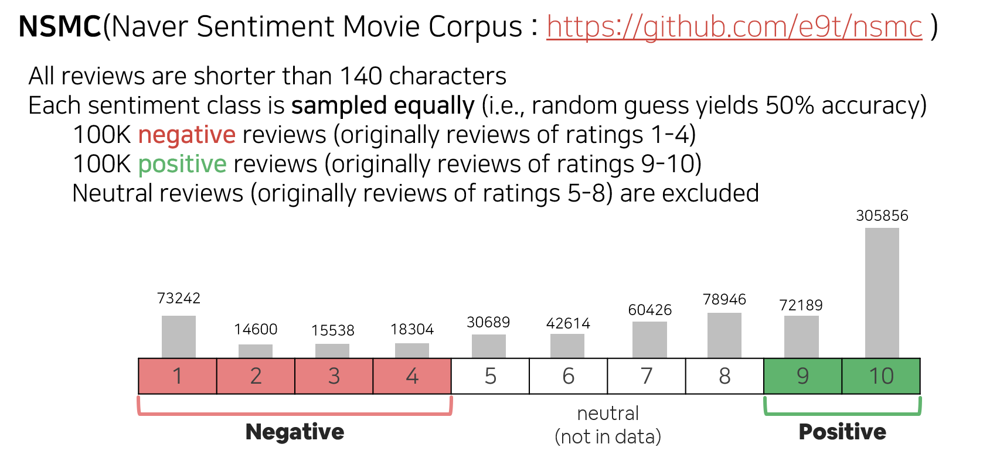
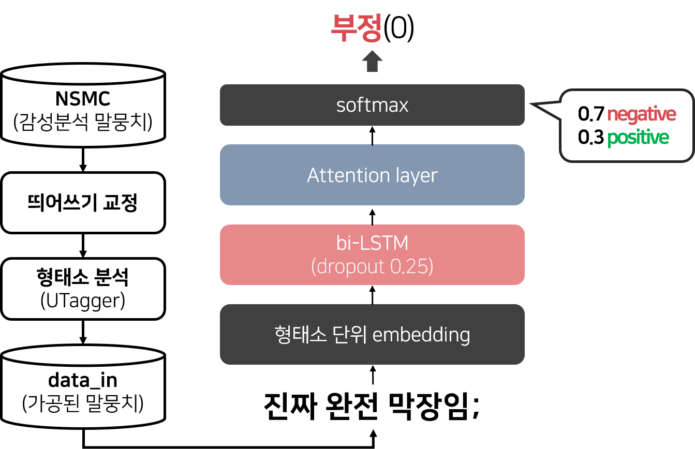

# recommendation_system
NSMC(Naver Sentiment Movie Corpus) 감성분석 모델을 활용한 영화 추천 시스템(피어슨 유사도, 문서 유사도 사용)
- [감성분석 모델](https://github.com/seoyeon960406/sentiment-analysis)의 긍정확률을 리뷰에 대한 평점으로 활용하여 사용자의 취향을 수집 후, 비슷한 취향의 사용자가 좋아한 영화(피어슨 유사도), 사용자가 좋아한 영화와 비슷한 영화(영화 시놉시스 문서의 유사도)를 추천

### Data
[Naver Sentiment Movie Corpus](https://github.com/e9t/nsmc)

- data_in/영화평점데이터.xlsx 는 지인들의 영화 취향을 수집하여 만든 파일임으로 데이터의 양이 충분하진 않음
- data_in/영화데이터_tokenized.txt 는 각 영화의 시놉시스 문서를 형태소 분석한 파일(한 줄이 하나의 문서)

### Package
- tensorflow v1.15
- gensim
- numpy
- soynlp
- sklearn
- [울산대학교 형태소 분석기 UTagger](http://klplab.ulsan.ac.kr)

### model

